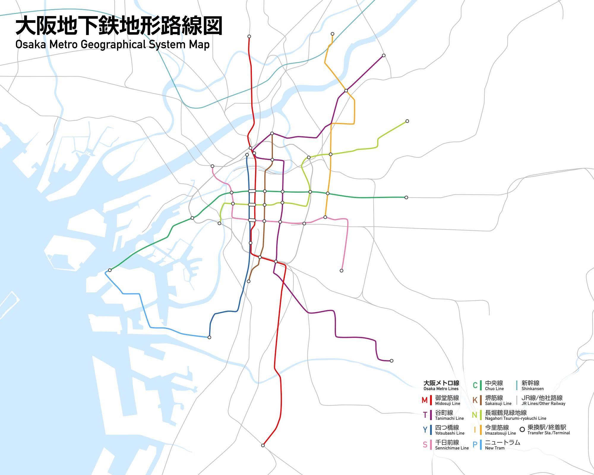

# Osaka Metro

| Index | Sign |                 Line Name                  |          From           |       To       |
| :---: | :--: | :----------------------------------------: | :---------------------: | :------------: |
|   1   |  M   | [Midosuji Line](<./1_midosuji-line/README.md>) |          Esaka          |   Nakamotsu    |
|   2   |  T   |               Tanimachi Line               |        Dainichi         |   Yao-minami   |
|   3   |  Y   |              Yotsubashi Line               |       Nishi-Umeda       |  Suminoekoen   |
|   4   |  C   |   [Chuo Line](<./4_chuo-line/README.md>)   |        Yumeshima        |     Nagata     |
|   5   |  S   |              Sennichimae Line              |       Nodahanshin       | Minami-Tatsumi |
|   6   |  K   |               Sakaisuji Line               | Tenjimbashisuji 6-chome |   Tengachaya   |
|   7   |  N   |       Nagahori Tsurumi-Ryokuchi Line       |         Tasiho          | Kadoma-minami  |
|   8   |  I   |              Imazatosuji Line              |         Itakano         |    Imazato     |
|   -   |  P   |            Nanko Port Town Line            |       Cosmosquare       |  Suminoekoen   |
